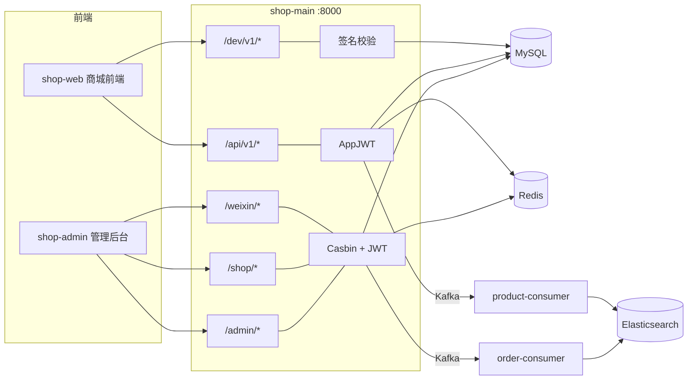
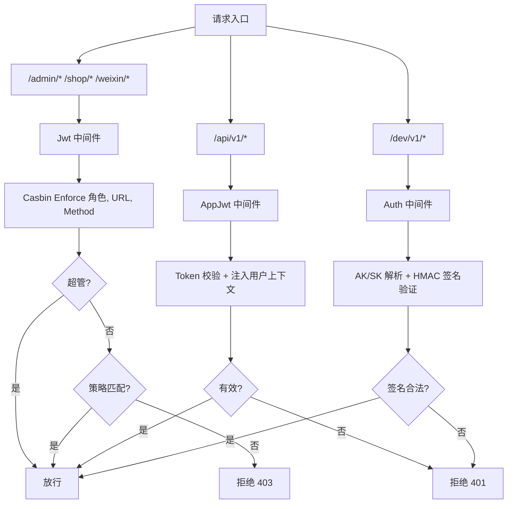
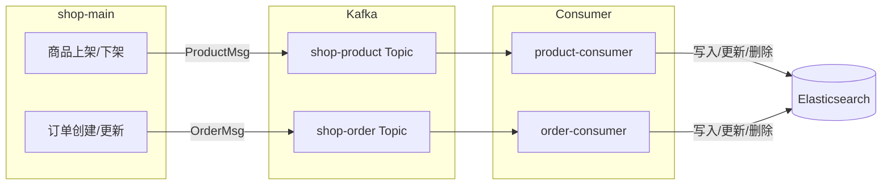

<div align="center">

# 🛒 Shop-Main

**Go-Search 核心业务微服务 — 商城后台与前台接口的统一入口**

[](https://golang.org)     [](https://gin-gonic.com)    [](https://gorm.io)  [](https://www.mysql.com)  [](https://redis.io)  [](https://kafka.apache.org)  [](LICENSE)

</div>

---

> `shop-main` 是 [Go-Search](https://github.com/HeRedBo/go-search) 项目的核心业务微服务，承担商城系统全部业务逻辑。  
> 基于 `Gin + Gorm + Casbin + JWT + Redis + MySQL + Kafka` 构建，涵盖 **后台管理** 与 **前台用户** 两大业务模块，提供 **50+ RESTful API** 接口。

---

## ✨ 核心能力

<table>
<tr>
<td width="50%">

#### 🔐 RBAC 权限体系
基于 Casbin 实现角色-菜单-接口三级权限校验，支持动态路由与数据权限隔离，超级管理员自动放行

</td>
<td width="50%">

#### 🔑 JWT 双通道鉴权
后台管理端（`Jwt()`）与前台用户端（`AppJwt()`）独立鉴权链路，互不干扰

</td>
</tr>
<tr>
<td>

#### 📡 Kafka 事件驱动
商品上架/下架、订单创建/更新等变更事件通过 Kafka 异步推送至消费者服务，解耦业务与搜索索引同步

</td>
<td>

#### ✍️ 接口签名校验
第三方开放 API 通过 HMAC 签名验证（AK/SK 机制），防篡改、防重放，保障接口安全

</td>
</tr>
<tr>
<td>

#### 📋 操作日志审计
Log 中间件自动记录操作人、请求路径、客户端 IP、耗时等信息，支持按菜单关联查询

</td>
<td>

#### 🔄 优雅关闭
基于 shutdownHook 监听系统信号，确保 HTTP Server、MySQL、Kafka Producer 等资源安全释放

</td>
</tr>
</table>

---

## 🏗️ 系统交互



| 路由组 | 鉴权方式 | 说明 |
| :--- | :--- | :--- |
| `/admin/*` `/shop/*` `/weixin/*` | Casbin + JWT | 后台管理 API，RBAC 策略校验 |
| `/api/v1/*` | AppJWT | 前台用户 API，独立 Token 鉴权 |
| `/dev/v1/*` | HMAC 签名校验 | 开放 API，AK/SK 防重放 |
| → Kafka | 异步推送 | 商品/订单变更 → consumer → ES |
| → MySQL / Redis | 同步读写 | 业务数据持久化与缓存 |

---

## 📦 功能模块

<details>
<summary><b>🛍️ 前台商城</b>  <code>/api/v1</code>  —  点击展开</summary>

| 模块 | 接口 | 说明 |
| :--- | :--- | :--- |
| 登录注册 | `POST /login` · `POST /register` | 手机号注册、JWT 鉴权 |
| 首页展示 | `GET /index` · `GET /getCanvas` | 轮播图、画布数据、商品推荐 |
| 商品浏览 | `GET /products` · `GET /product/detail/:id` | 商品列表、详情、多规格 SKU |
| 商品搜索 | `GET /product/search` | 关键词搜索（可对接 ES 搜索服务） |
| 商品收藏 | `POST /collect/add` · `POST /collect/del` | 收藏/取消收藏 |
| 购物车 | `POST /cart/add` · `GET /carts` · `POST /cart/del` | 加购、数量修改、删除 |
| 订单流程 | `confirm` → `computed` → `create` → `pay` | 确认 → 计算 → 创建 → 支付全流程 |
| 支付回调 | `ANY /order/notify` | 微信支付异步通知回调 |
| 订单管理 | `GET /order` · `POST /order/take` · `POST /order/cancel` | 订单列表、收货、取消 |
| 商品评价 | `POST /order/comments/:key` | 订单评价提交 |
| 个人中心 | `GET /userinfo` · `POST /upload` | 用户信息、头像上传 |

</details>

<details>
<summary><b>⚙️ 后台管理</b>  <code>/admin</code> + <code>/shop</code> + <code>/weixin</code>  —  点击展开</summary>

**系统管理**

| 模块 | 路由组 | 说明 |
| :--- | :--- | :--- |
| 系统用户 | `/admin/user` | 用户 CRUD、密码修改、头像更换 |
| 角色管理 | `/admin/roles` | RBAC 角色-菜单绑定、数据权限 |
| 菜单管理 | `/admin/menu` | 动态路由树、后端可配置化 |
| 部门管理 | `/admin/dept` | 组织架构树形配置 |
| 岗位管理 | `/admin/job` | 部门岗位配置 |
| 字典管理 | `/admin/dict` + `/admin/dictDetail` | 数据字典与字典项维护 |
| 日志审计 | `/admin/logs` | 操作日志查询与清理 |
| 素材管理 | `/admin/material` | 图片素材库、分组管理 |
| 画布装修 | `/admin/canvas` | 首页画布数据可视化配置 |

**商城管理**

| 模块 | 路由组 | 说明 |
| :--- | :--- | :--- |
| 商品分类 | `/shop/cate` | 多级分类树形管理 |
| 商品管理 | `/shop/product` | 单/多规格商品、上下架、SKU 管理 |
| 商品规格 | `/shop/rule` | 规格（SKU）规则模板 |
| 订单管理 | `/shop/order` | 订单发货、备注、详情查看 |
| 物流快递 | `/shop/express` | 快递公司管理、快递鸟查询 |

**微信管理**

| 模块 | 路由组 | 说明 |
| :--- | :--- | :--- |
| 微信菜单 | `/weixin/menu` | 公众号自定义菜单 |
| 微信用户 | `/weixin/user` | 微信用户管理、余额调整 |
| 微信图文 | `/weixin/article` | 公众号图文管理、发布 |

</details>

<details>
<summary><b>🔗 开放 API</b>  <code>/dev/v1</code>  —  点击展开</summary>

| 模块 | 接口 | 说明 |
| :--- | :--- | :--- |
| 第三方接入 | `GET /orders/user/:uid` | AK/SK 签名校验、按用户查询订单 |

</details>

---

## 🧩 项目结构

```
shop-main/
├── conf/                               # 配置管理
│   ├── config.yml                      #   主配置文件（Viper 解析）
│   ├── config.go                       #   配置结构体定义与加载
│   └── constant.go                     #   常量定义
│
├── internal/                           # 核心业务代码
│   ├── controllers/                    # 控制器层
│   │   ├── admin/                      #   后台控制器（20 个）
│   │   │   ├── LoginController.go      #     登录 / 验证码 / 用户信息
│   │   │   ├── UserController.go       #     用户管理
│   │   │   ├── RoleController.go       #     角色管理
│   │   │   ├── StoreProductController  #     商品管理（6.1KB，最复杂）
│   │   │   ├── OrderController.go      #     订单管理
│   │   │   └── ...                     #     15 个其他控制器
│   │   ├── front/                      #   前台控制器（7 个）
│   │   │   ├── OrderController.go      #     订单全流程（10.4KB）
│   │   │   ├── ProductController.go    #     商品浏览/搜索/收藏
│   │   │   ├── CartController.go       #     购物车
│   │   │   └── ...
│   │   └── dev/                        #   开放 API 控制器
│   │
│   ├── models/                         # 数据模型层（35+ 模型）
│   │   ├── dto/                        #   数据传输对象
│   │   ├── vo/                         #   视图对象
│   │   ├── store_order.go              #   订单模型（30+ 字段、游标分页）
│   │   ├── store_product.go            #   商品模型（多规格、上下架）
│   │   ├── sys_user.go                 #   系统用户模型
│   │   ├── sys_role.go                 #   角色模型
│   │   ├── sys_memu.go                 #   菜单模型
│   │   └── ...                         #   30+ 其他模型
│   │
│   ├── params/                         # 请求参数定义（14 个）
│   │
│   └── service/                        # 业务逻辑层（24+ 服务）
│       ├── product_service/            #   商品服务（CRUD + 上下架 + Kafka 推送）
│       ├── order_service/              #   订单服务（创建 + 支付 + 状态流转 + Kafka 推送）
│       ├── cart_service/               #   购物车服务
│       ├── pay_service/                #   支付服务（微信支付 + 余额支付）
│       ├── auth_service/               #   签名认证服务（AK/SK）
│       ├── wechat_menu_service/        #   微信公众号菜单服务
│       └── ...                         #   18+ 其他服务
│
├── middleware/                          # 中间件
│   ├── auth_check.go                   #   JWT 鉴权（管理端 / 用户端 / 签名校验 三种模式）
│   ├── cors.go                         #   跨域处理
│   └── log.go                          #   操作日志审计（菜单名 / 耗时 / IP）
│
├── pkg/                                # 项目私有工具包
│   ├── casbin/                         #   Casbin 权限管理初始化
│   ├── jwt/                            #   JWT Token 生成与校验
│   ├── app/                            #   Gin 响应封装
│   ├── base/                           #   基础工具
│   ├── constant/                       #   常量定义
│   ├── enums/                          #   枚举类型（6 个）
│   ├── global/                         #   全局变量
│   ├── logging/                        #   日志工具
│   ├── upload/                         #   文件上传
│   ├── util/                           #   通用工具（4 个）
│   └── runtime/                        #   运行时（Casbin 实例等）
│
├── routers/
│   └── router.go                       # 路由注册（258 行 · 50+ 路由 · 4 路由组）
│
├── sql/                                # 数据库初始化脚本
├── runtime/                            # 运行时资源（上传文件、日志）
├── .air.toml                           # Air 热重载配置
├── go.mod
└── main.go                             # 入口文件（优雅关闭）
```

---

## 🛠️ 技术栈

<table>
<tr><th colspan="3" align="center">后端</th></tr>
<tr><th>分类</th><th>技术</th><th>用途</th></tr>
<tr><td>语言</td><td></td><td>开发语言</td></tr>
<tr><td>Web 框架</td><td></td><td>HTTP 路由与中间件</td></tr>
<tr><td>ORM</td><td></td><td>数据库操作、关联预加载、软删除</td></tr>
<tr><td>权限</td><td></td><td>RBAC 角色菜单权限、策略持久化</td></tr>
<tr><td>认证</td><td></td><td>管理端 & 用户端双 Token 鉴权</td></tr>
<tr><td>缓存</td><td></td><td>Token 存储、数据缓存</td></tr>
<tr><td>数据库</td><td></td><td>业务数据持久化</td></tr>
<tr><td>消息队列</td><td></td><td>商品/订单变更事件异步推送</td></tr>
<tr><td>日志</td><td></td><td>结构化日志、文件轮转</td></tr>
<tr><td>配置</td><td></td><td>YAML 配置热加载</td></tr>
<tr><td>支付</td><td></td><td>微信支付 JSAPI / Native</td></tr>
<tr><td>微信</td><td></td><td>公众号菜单、消息、用户管理</td></tr>
<tr><td>工具</td><td></td><td>结构体拷贝 / 分布式 ID / 精确小数</td></tr>
<tr><td>优雅关闭</td><td></td><td>信号监听、资源安全释放</td></tr>
</table>

<table>
<tr><th colspan="2" align="center">前端</th></tr>
<tr><th>技术</th><th>说明</th></tr>
<tr><td></td><td>前端框架</td></tr>
<tr><td></td><td>UI 组件库</td></tr>
<tr><td></td><td>状态管理</td></tr>
<tr><td></td><td>路由管理</td></tr>
<tr><td></td><td>HTTP 请求</td></tr>
</table>

---

## 🔍 关键设计

### 🔐 三层鉴权体系



| 鉴权模式 | 适用路由 | 校验链路 | 特点 |
| :--- | :--- | :--- | :--- |
| **管理端** | `/admin/*` `/shop/*` `/weixin/*` | JWT → Casbin Enforce | URL 参数化匹配，超管自动放行 |
| **用户端** | `/api/v1/*` | AppJWT → Token 校验 | 独立鉴权，注入用户上下文 |
| **开放 API** | `/dev/v1/*` | AK/SK → HMAC 签名 | 时间窗口防重放，第三方安全接入 |

### 📡 Kafka 事件驱动



| 事件源 | 消息结构 | Kafka Topic | 消费者 | ES 操作 |
| :--- | :--- | :--- | :--- | :--- |
| 商品上架/下架 | `ProductMsg{operation, is_show}` | `shop-product` | product-consumer | BulkCreate / DeleteRefresh |
| 订单创建/更新 | `OrderMsg{operation, status}` | `shop-order` | order-consumer | BulkCreate / Delete |

- **消息定义** — 商品/订单 Model 层定义 `ProductMsg` / `OrderMsg`，携带 `operation` 操作类型
- **推送时机** — Service 层在业务变更后通过 Kafka SyncProducer 推送消息
- **消费处理** — 消费者根据 `operation` 类型决定 ES 写入 / 更新 / 删除操作


## 🚀 快速开始

### 环境要求

<table>
<thead>
<tr><th>依赖</th><th>版本</th><th>说明</th></tr>
</thead>
<tbody>
<tr>
<td></td>
<td>>= 1.23</td><td>开发语言</td>
</tr>
<tr>
<td></td>
<td>>= 5.7</td><td>关系型数据库，必须</td>
</tr>
<tr>
<td></td>
<td>>= 4.0</td><td>缓存，必须</td>
</tr>
<tr>
<td></td>
<td>2.x+</td><td>消息队列，必须</td>
</tr>
</tbody>
</table>

### 部署步骤

**① 安装 Go 环境**

```bash
go env -w GO111MODULE=on
go env -w GOPROXY=https://goproxy.cn,direct
```

**② 获取项目**

```bash
git clone https://github.com/HeRedBo/shop-main.git
cd shop-main && go mod tidy
```

**③ 初始化数据库**

```bash
# 导入 sql/ 目录下的 SQL 文件到 MySQL 数据库
```

**④ 修改配置** — 编辑 `conf/config.yml`

```yaml
server:
  run-mode: 'debug'
  http-port: 8000

database:          # MySQL 连接配置
  user: 'root'
  password: 'root'
  host: '127.0.0.1:3306'
  name: 'shop'

redis:             # Redis 连接配置
  host: '127.0.0.1:6379'
  password:

kafka:             # Kafka 连接配置
  hosts: ["127.0.0.1:9092"]
```

**⑤ 启动服务**

```bash
# 开发模式（热重载，需安装 air）
air

# 或直接运行
go run main.go
```

> 服务默认监听 `:8000`

**⑥ 默认账号**

| 角色 | 账号 | 密码 |
| :--- | :--- | :--- |
| 后台管理员 | admin | 123456 |

---

## 🔗 关联项目

| 项目 | 说明 |
| :--- | :--- |
| [Go-Search](https://github.com/HeRedBo/go-search) | 项目总入口 |
| [pkg](https://github.com/HeRedBo/pkg) | 核心基础设施库（MySQL / Redis / ES / Kafka / MongoDB 等封装） |
| [shop-search-api](https://github.com/HeRedBo/shop-search-api) | 搜索 API 微服务（ES8 商品/订单搜索接口） |
| [order-consumer](https://github.com/HeRedBo/order-consumer) | 订单数据同步消费者（Kafka → ES） |
| [product-consumer](https://github.com/HeRedBo/product-consumer) | 商品数据同步消费者（Kafka → ES） |
| [shop-admin](https://github.com/HeRedBo/shop-admin) | 管理后台前端（Vue2 + Element UI） |
| [shop-web](https://github.com/HeRedBo/shop-web) | 商城前端（Vue2 + Element UI） |

---

<div align="center">

**Apache-2.0** License

</div>
